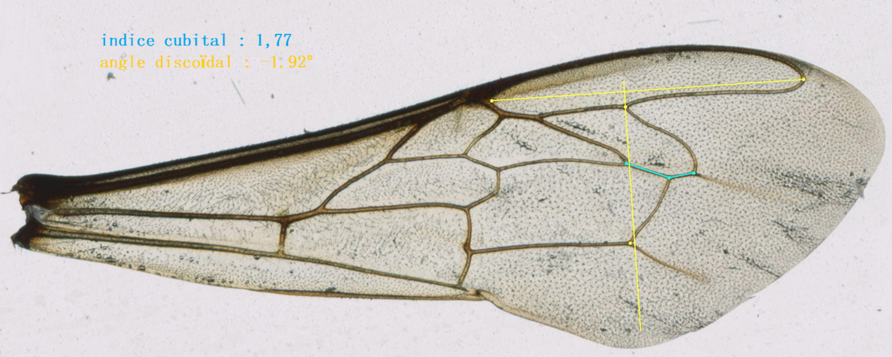

# beeReal
beeReal is a morphometric analysis tool for honey bee wings.

Honey bees (Apis mellifera) are divided into around 28 subspecies worldwide. These subspecies differ in both their behavior and physical characteristics. The measurement of the bee’s physical characteristics, known as morphometrics, makes it possible to distinguish between these subspecies. In honey bees, several traits can be measured, such as tongue length, hairiness, or body size. However, the most effective method consists in analyzing wing venation. This program analyzes images of honey bee wings and allows easy measurement of the cubital index and discoidal angle. The user must place 7 points of interest and repeat the operation for at least 30 wings in order to obtain a statistically representative sample of the colony.

https://www.beereal.blog/
